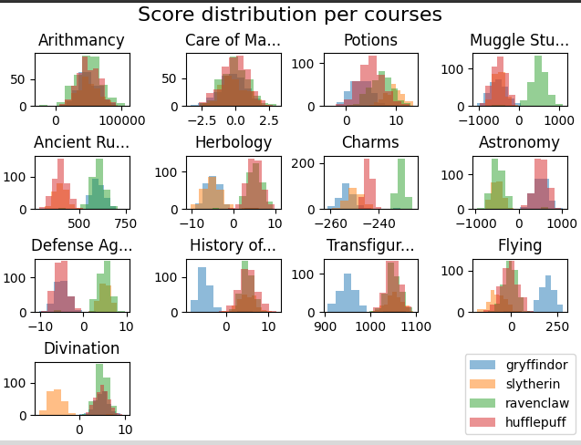

# Welcome to DSLR

### Get dependency
```bash
./install.py
```

### Describe
Le describe est une fonction d'analyse qui résume les principales caractéristiques statistiques d'un dataset.   

```bash
./describe.py datasets/dataset_train.csv
```


- Moyenne : Indique la valeur moyenne des données, utile pour comprendre la tendance centrale.
- Écart-Type : Mesure la dispersion des données autour de la moyenne, indiquant à quel point les valeurs sont étendues.
- Minimum/Maximum : Les valeurs les plus petites et les plus grandes, montrant la plage de données.
- Quartiles : Points de division qui partagent les données en quatre parties égales, aidant à comprendre la distribution.
- Variance : Similaire à l'écart-type, mais élève les différences au carré, offrant une autre perspective de la dispersion.
- Skewness : Révèle si les données sont symétriques ou si elles s'étendent plus d'un côté, indiquant l'asymétrie de la distribution.
- Kurtosis : Mesure le degré de concentration des valeurs extrêmes dans une distribution, comparé à une distribution normale. Une haute kurtosis indique une concentration plus élevée de valeurs extrêmes.

## 2.1 Histogram

```bash
./histogram.py
```

L'histogramme montre la distribution des scores des différentes maisons dans les différents cours.   
L'objectif étant de voir quel cours a le score le plus homogène.
La démarche utilisé calcule la standardisation (z-score) des notes par matière;   
Regroupe les données par maison de Poudlard, et calcule la moyenne par groupe.   
Ensuite, elle détermine la matière avec l'écart-type le plus bas parmi les moyennes groupées, identifiant ainsi la matière la plus homogène

Ici c'est Arithmancy




## 2.2 Corelation de Pearson

To launch : 
```bash
./scatter_plot.py datasets/dataset_train.csv
```

La corelation de Pearson nous permet de voir sur une echelle de -1 (inverse) - 0 (aucun) - 1 (pareil) a quelle points deux variables d'un jeux de donne se resemble.

La formule doit etre applique entre toutes les combinaisons des variables de notre dataframe: 

$$
r = \frac{\sum_{i=1}^{n} (x_i - \overline{x}) (y_i - \overline{y})}{\sqrt{\sum_{i=1}^{n} (x_i - \overline{x})^2 \sum_{i=1}^{n} (y_i - \overline{y})^2}}
$$

Pourquoi mettre 0 au diagonal de la matrice :
Extraction de Caractéristiques ou de Relations Spécifiques

Si vous cherchez à identifier les paires de variables ayant la corrélation la plus élevée ou la plus basse, remplir la diagonale avec des zéros peut empêcher que les corrélations parfaites (de 1.0) des variables avec elles-mêmes ne faussent votre analyse ou vos algorithmes de sélection de caractéristiques.

Apres analyse de toutes les matieres les une avec les autres, celles avec le scores le plus proche d'un extreme (-1 / 1), sont Astronomy et Defense Against the Dark Arts


## Pair Plot

Ici, juste de l'affichage graphique avec de l'interprétation visuelle pour éliminer les matières qui n'ont pas d'intérêt pour la régression un contre tous.


Ici, utiliser des matières trop corrélées (cf. 2.2) doublerait leur influence, donc on peut n'en prendre qu'une.   
Et celles dont la distribution des points ne révèle rien peuvent être écartées aussi, comme "Care of Magical Creatures" par exemple.


## 3 Train et Predict

## One vs All

Une régression One vs All (un contre tous) consiste à faire plusieurs régressions, une par catégorie.    
Ici, on veut créer un chapeau magique, qui va décider à quelle maison d'Harry Potter on appartient. Donc, nous allons faire 4 régressions, une par maison dans Harry Potter.   
Nous allons mettre à 1 la maison sur laquelle nous faisons notre régression et à 0 les autres; nous répéterons l'opération pour chaque maison.


## Train

Avant de vouloir faire une prédiction, nous devons entraîner notre algorithme pour obtenir des poids.    
Ces poids nous serviront lors de la détermination pour nos prédictions. Avant d'entraîner, nous devons nettoyer notre dataframe.    
Nous avons choisi de remplacer les valeurs NaN par la valeur moyenne de la matière pour préserver l'intégrité des données, sinon trop de données auraient été supprimées.   
De plus, il faut la normaliser : 


$$X = \frac{X - \text{mean}(X)}{\text{std}(X)}$$


Une fois la data clean, il faut passer a la descente de gradint avec la derive de la loss function : 

$$
\frac{\partial}{\partial \theta_j} J(\theta) = \frac{1}{m} \sum_{i=1}^{m} \left( h_\theta(x^{(i)}) - y^{(i)} \right) x_j^{(i)}
$$

Cela nous donnera les poids pour chaque matière pour une maison.   
Il faut donc faire les 4 maisons, sauvegarder cela dans un fichier pour l'utiliser plus tard pour les prédictions.

## Usage Train
```bash
./logreg_train.py datasets/dataset_train.csv
```
```
Option :
-h : show information 
-show arg1 ... argn : list des maisons pour lequelles nous verrons le cost_history
-gradient arg : pour changer le type de descente de gradient que nous fesont
```

## Predict

Une fois que nous avons nos poids, avec un fichier similaire à celui de dataset_train.csv, mais sans les 'Hogwarts House' définies pour les élèves, nous allons utiliser notre fichier de poids et les notes des élèves pour déterminer à quelle maison ils appartiennent.

Pour cela, nous normalisons les données et les préparons de la même façon que celle faite dans le programme d'entraînement.